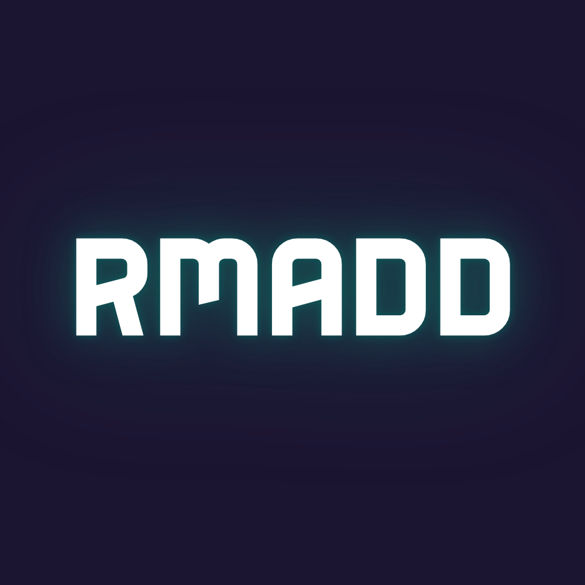
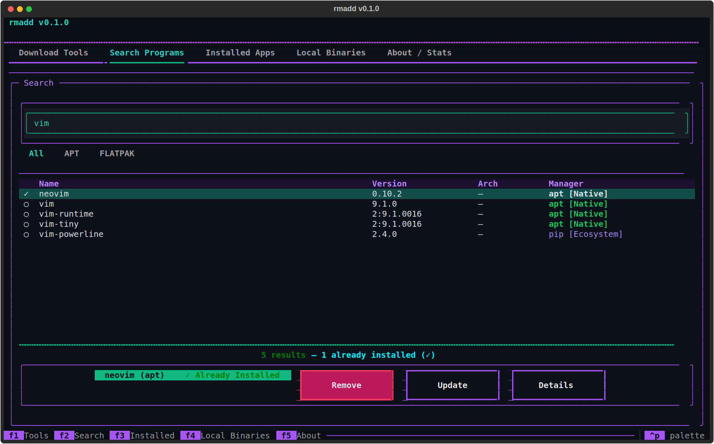
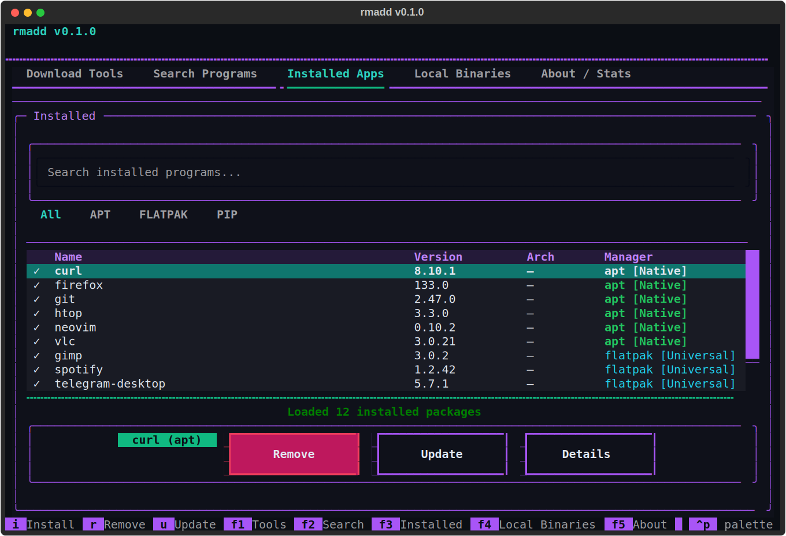
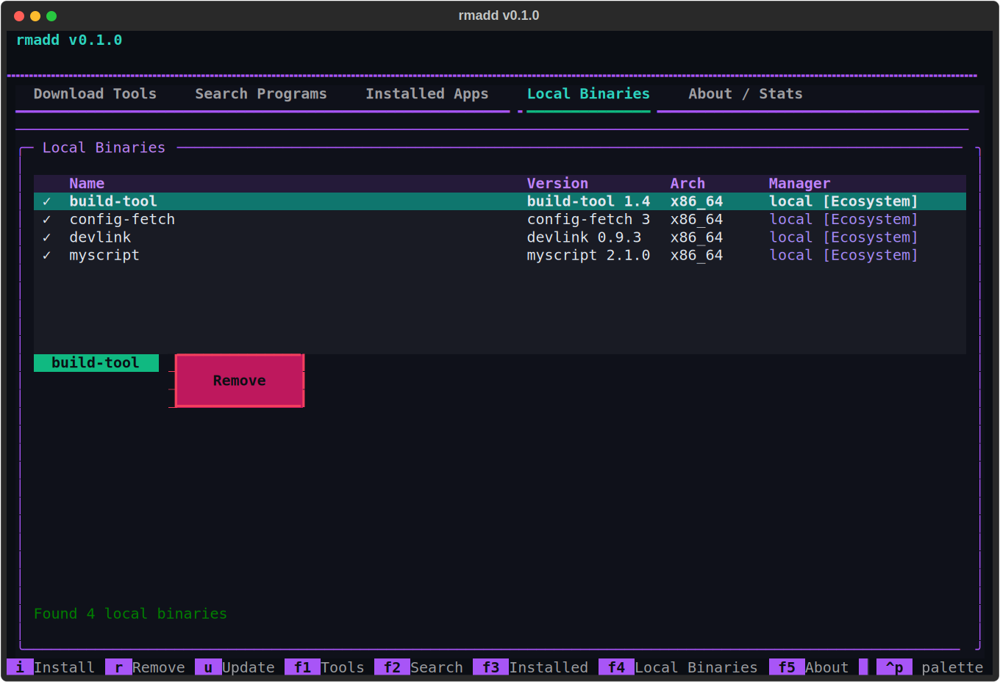

<p align="center">
  
</p>

# rmadd

An all-in-one, modular Textual-based TUI application for Linux system
monitoring and cross-distribution package management.

> UNDER ACTIVE DEVELOPMENT (WIP). Structure and features change quickly.

---

## Features

* **Instant Optimistic UI** — actions mutate the UI and in-memory state
  immediately (zero-latency row removal), then reconcile with the real
  subprocess result through a confirm/revert lifecycle on the state bus.
* **Direct Action Flow** — no blocking confirmation dialogs: `remove` fires
  immediately; a failed removal silently restores the row and surfaces a
  toast.
* **Dynamic Search Action Bar** — the Search tab is context-aware: installed
  packages show Remove/Update, available ones show Install, with a live
  installed/available status label and installed-version enrichment.
* **Physical Local Binary Management** — the Local Binaries tab resolves
  absolute paths via `$PATH` scanning and `shutil.which()`, unlinks
  user-level binaries directly, and elevates via `pkexec`/`sudo` for system
  paths like `/usr/bin`.
* Dynamic System Info: distribution, kernel, architecture and uptime without
  distro-specific hardcoding.
* Package Manager Detection: probes and counts installed packages across
  many manager families:
  - Native: apt, dpkg, dnf, yum, rpm, zypper, apk, pacman, emerge, xbps,
    nix, eopkg, slackpkg.
  - Universal: flatpak, snap, brew, appimage.
  - Ecosystem: pip, pipx, cargo, npm, pnpm, yarn, bun, go, gem, composer.
* Keyboard-driven TUI built with Textual: tabbed store, live search,
  streaming install/remove/update with progress, cancel + ETA.
* CLI subcommands for scripting: info, packages, hardware.
* Non-blocking I/O: subprocess calls run off the UI thread (thread pool and
  asyncio.to_thread), debounced search, 5s stats refresh, TTL caches.
* Flat package layout: everything lives under one `rmadd/` package - no DI
  container, no hexagonal indirection.

## Visual Overview

All screenshots live in `docs/assets/`. Sizes are fixed for a consistent,
scannable layout: the hero shot is 640 px wide, grid shots are 320 px each,
and the logo is 180 px.

<!-- Insert GIF demo here (e.g., docs/assets/optimistic-removal.gif) -->

**Search & Dynamic Action Bar**

<p align="center">
  
</p>

<p align="center">
  <em>Search tab: live results, installed-status labels, and the context-aware
  action bar (Install / Remove / Update).</em>
</p>

<table align="center">
  <tr>
    <td align="center">
      
      <br/>
      <em>Installed Applications with per-manager filtering.</em>
    </td>
    <td align="center">
      
      <br/>
      <em>Local Binaries — rows vanish instantly on removal and reappear on
      failure.</em>
    </td>
  </tr>
</table>

<!-- Insert GIF demo here (e.g., docs/assets/demo.gif) -->

**Expected asset files** (add to `docs/assets/`):

| File | Size | Placement |
|------|------|-----------|
| `logo.png` | 180 px | Top of page, centered |
| `search-view.png` | 640 px | Visual Overview hero shot |
| `installed-apps.png` | 320 px | Visual Overview grid, left |
| `local-binaries.png` | 320 px | Visual Overview grid, right |
| `optimistic-removal.gif` | — | Optional demo (Visual Overview) |
| `demo.gif` | — | Optional demo (Visual Overview) |

## Requirements

* Python 3.10+
* textual (see requirements.txt)

## Project Structure

```text
main.py
  Entry point; builds services, selects UI mode (tui or cli).
rmadd/
  models.py                  PackageManager, Package, PackageCollection,
                             SystemInfo and hardware dataclasses.
  state.py                   PackageStateBus - app-wide pub/sub bus with
                             pending/confirmed/reverted lifecycle phases.
  package_managers/          BaseAdapter + discovery registry, plus one
    base.py                  module per package manager and the service.
    service.py               PackageManagerService: search/install/counts.
    <manager>.py             one adapter per manager (apt, dnf, flatpak, ...)
    local.py                 opt-in PATH binary scanner + physical removal.
  screens/
    store_screen.py          StoreScreen: the tabbed store screen; owns the
                             optimistic lifecycle (instant removal + revert).
    widgets/                 PackageTable, ToolsTable, SystemCard.
    install_progress_screen.py, package_detail_screen.py,
    appimage_install_screen.py
  system_info.py             SystemInfoService + HostnamectlAdapter
  hardware.py                ProcFsAdapter + HardwareMonitorService.
  cache.py                   TTL caching for system and hardware providers.
  tools.py                   InstallerTool detection for the Tools tab.
  tui.py                     RmaddTuiApp (cyberpunk theme).
  cli.py                     info / packages / hardware subcommands.
  config.py                  JSON config (ui.mode).
  logging.py                 file logging setup.
style.tcss                   Textual CSS stylesheet.
docs/
  LOCAL_BINARIES.md          Local binaries guide (discovery & deletion).
  assets/                    Logos, screenshots and demo GIFs.
```

## Download

```bash
curl -L https://github.com/Nawras448/rmadd/archive/refs/heads/main.tar.gz | tar -xz

```

## Usage

```bash
pip install -r requirements.txt # 3. Setting the requirements
python main.py                  # TUI (default)

# CLI mode
echo '{"ui":{"mode":"cli"}}' > ~/.config/rmadd/config.json
python main.py info
python main.py packages
python main.py hardware
```

Reset to TUI mode:

```bash
echo '{"ui":{"mode":"tui"}}' > ~/.config/rmadd/config.json
```

* Config file: `~/.config/rmadd/config.json`
* Logs: `~/.local/share/rmadd/logs/app.log`

## Key Bindings

| Key      | Action                                |
|----------|---------------------------------------|
| F1 - F5  | Switch tab (Tools/Search/Installed/Local/About) |
| i / r / u | Install / remove / update selected package |
| Enter    | Open package detail                   |
| r (app)  | Force refresh all stats               |
| q        | Quit                                  |

## Documentation

* `ARCHITECTURE.md` — module map, data flow, `PackageStateBus` lifecycle.
* `docs/LOCAL_BINARIES.md` — local binary discovery, path resolution and
  deletion permissions.
